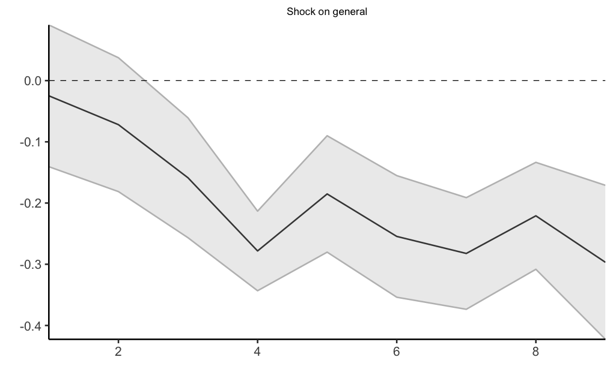
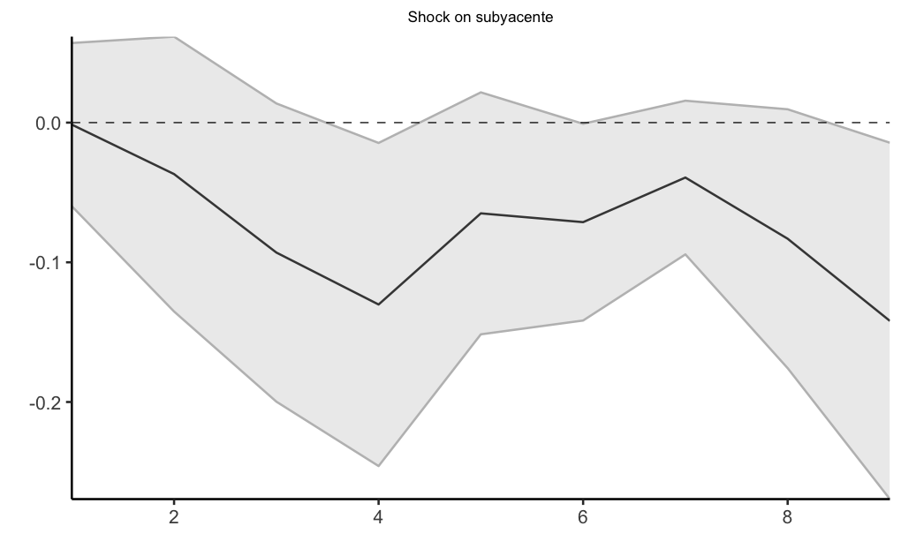

# Choques Monetarios y Transmisión a la Inflación en México (VAR)

Este proyecto estima un modelo de **Vectores Autorregresivos (VAR)** para analizar
los efectos dinámicos de un **choque de política monetaria**, identificado a través
de la tasa TIIE a 28 días, sobre distintas variables macroeconómicas en México.

El objetivo principal es estudiar la transmisión de la política monetaria
hacia la actividad económica y los precios, distinguiendo entre inflación
general, subyacente y no subyacente.

---
## Metodología

El análisis se desarrolla en dos etapas principales:

1. **Identificación del choque monetario**
   - Estimación de un VAR con variables macroeconómicas de México y variables
     internacionales tratadas como exógenas.
   - Identificación estructural mediante ordenamiento de Cholesky,
     donde la tasa de política monetaria (TIIE_28) captura el choque monetario.

2. **Análisis dinámico**
   - Cálculo de Funciones Impulso–Respuesta (IRFs).
   - Intervalos de confianza obtenidos mediante bootstrap.
   - Comparación de respuestas entre inflación general, subyacente y no subyacente.

---
## Resultados principales

Los resultados sugieren que un choque contractivo de política monetaria:

- Tiene efectos negativos sobre la actividad económica.
- Genera respuestas heterogéneas en los componentes de la inflación:
  - La inflación no subyacente presenta respuestas más volátiles.
  - La inflación subyacente responde de manera más gradual y persistente.
- Refleja una transmisión monetaria incompleta, consistente con la evidencia
  empírica para economías emergentes.

---
## Figuras

A continuación se presentan las principales gráficas del proyecto.  
(Las figuras se encuentran en la carpeta `figures/`)

### Funciones Impulso–Respuesta del VAR

**IRFs ante un choque en la TIIE_28 (IC 95%)**

---
### Respuesta de la inflación a choques monetarios (Proyecciones Locales)

**Inflación general**

**Inflación no subyacente**

**Inflación subyacente**

---
### Choque monetario estructural identificado

**Serie temporal del choque monetario estructural (TIIE_28)**

---
## Archivos del proyecto
- `Codigo_Ejercicio_Practico.Rmd`: main R Markdown file with the estimation code
- `Figures`

---
## Referencias
La especificación y la estrategia de identificación del VAR se inspiran en la literatura sobre transmisión monetaria para México, en particular:

Capistrán, C., Ibarra, R., & Ramos-Francia, M. (2012).  
*El traspaso de movimientos del tipo de cambio a los precios: un análisis para la economía mexicana*.  
El Trimestre Económico.

---
## Nota
- Data is not included in the repository.

